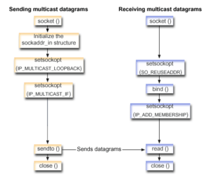

# Assignment 7

## Objective: WAP to implement multicasting using socket programming.


Steps need to preform multicasting for connection-less client/server communication are:
### Sequence of API calls for sending multicast datagrams:
1. Create an `AF_INET`, `SOCK_DGRAM` type socket.
2. Initialize a `sockaddr_in` structure.
3. Set the `IP_MULTICAST_LOOP` socket option according to whether the sending system should receive a copy of the multicast datagrams that are transmitted.
4. Set the `IP_MULTICAST_IF` socket option to define the local interface over which you want to send the multicast datagrams.
5. Send the datagram.

### Sequence of API calls for receiving multicast datagrams:
1. Create an `AF_INET`, `SOCK_DGRAM` type socket.
2. Set the `SO_REUSEADDR` option to allow multiple applications to receive datagrams that are destined to the same local port number.
3. Use the bind() verb to specify the local port number. Specify the IP address as INADDR_ANY in order to receive datagrams that are addressed to a multicast group.
4. Use the `IP_ADD_MEMBERSHIP` socket option to join the multicast group that receives the datagrams. When joining a group, specify the class D group address along with the IP address of a local interface. The system must call the `IP_ADD_MEMBERSHIP` socket option for each local interface receiving the multicast datagrams.
5. Receive the datagram.

### Multicast Sender
```c
/* Copyright 2024 Keys */
#include <stdio.h>
#include <stdlib.h>
#include <string.h>
#include <unistd.h>
#include <arpa/inet.h>
#include <sys/socket.h>

#define MULTICAST_GROUP "239.0.0.1"
#define PORT 12345
#define BUFFER_SIZE 1024

int main() {
    int sock;
    struct sockaddr_in multicast_addr;
    char *message = "Hello, Multicast";
    struct ip_mreq mreq;
    int loop = 1;

    if ((sock = socket(AF_INET, SOCK_DGRAM, 0)) < 0) {
        perror("Socker Creation Failed");
        exit(EXIT_FAILURE);
    }

    memset(&multicast_addr, 0, sizeof(multicast_addr));
    multicast_addr.sin_family = AF_INET;
    multicast_addr.sin_addr.s_addr = inet_addr(MULTICAST_GROUP);
    multicast_addr.sin_port = htons(PORT);

    if (setsockopt(sock, IPPROTO_IP, IP_MULTICAST_LOOP, &loop, sizeof(loop)) < 0) {
        perror("Unable to set socket option");
        close(sock);
        exit(EXIT_FAILURE);
    }

    struct in_addr local_interface;
    local_interface.s_addr = INADDR_ANY;
    if(setsockopt(sock, IPPROTO_IP, IP_MULTICAST_IF, &local_interface, sizeof(local_interface)) < 0) {
        perror("Unable to set socket option");
        close(sock);
        exit(EXIT_FAILURE);
    }

    if(sendto(sock, message, strlen(message), 0, (struct sockaddr *)&multicast_addr, sizeof(multicast_addr)) < 0) {
        perror("Send Failed");
        close(sock);
        exit(EXIT_FAILURE);
    } else {
        printf("Message sent to multicast group %s on port %d\n", MULTICAST_GROUP, PORT);
    }

    close(sock);
    return 0;
}
```

### Multicast Receiver
```c
/* Copyright 2024 Keys */
#include <stdio.h>
#include <stdlib.h>
#include <string.h>
#include <sys/types.h>
#include <unistd.h>
#include <arpa/inet.h>
#include <sys/socket.h>

#define MULTICAST_GROUP "239.0.0.1"
#define PORT 12345
#define BUFFER_SIZE 1024

int main() {
    int sock;
    struct sockaddr_in recv_addr;
    struct ip_mreq mreq;
    char buffer[BUFFER_SIZE];
    socklen_t addr_len;

    if ((sock = socket(AF_INET, SOCK_DGRAM, 0)) < 0) {
        perror("Socker Creation Failed");
        exit(EXIT_FAILURE);
    }

    int reuse = 1;
    if (setsockopt(sock, SOL_SOCKET, SO_REUSEADDR, &reuse, sizeof(sock)) < 0) {
        perror("Unable to set socket option");
        close(sock);
        exit(EXIT_FAILURE);
    }

    memset(&recv_addr, 0, sizeof(recv_addr));
    recv_addr.sin_family = AF_INET;
    recv_addr.sin_addr.s_addr = INADDR_ANY;
    recv_addr.sin_port = htons(PORT);

    if (bind(sock, (struct sockaddr*)&recv_addr, sizeof(recv_addr)) < 0) {
        perror("Bind Failed");
        close(sock);
        exit(EXIT_FAILURE);
    }

    mreq.imr_multiaddr.s_addr = inet_addr(MULTICAST_GROUP);
    mreq.imr_interface.s_addr = INADDR_ANY;
    if(setsockopt(sock, IPPROTO_IP, IP_ADD_MEMBERSHIP, &mreq, sizeof(mreq)) < 0){
        perror("Unable to set socket option");
        close(sock);
        exit(EXIT_FAILURE);
    }

    printf("Receiver is listening on port 12345...\n");

    addr_len = sizeof(recv_addr);
    ssize_t recv_len = recvfrom(sock ,buffer, BUFFER_SIZE - 1, 0, (struct sockaddr *)&recv_addr, &addr_len);
    if (recv_len < 0) {
        perror("Receive Failed");
        close(sock);
        exit(EXIT_FAILURE);
    }

    buffer[recv_len] = '\0';
    printf("Received: %s\n", buffer);

    close(sock);
    return 0;
}
```
